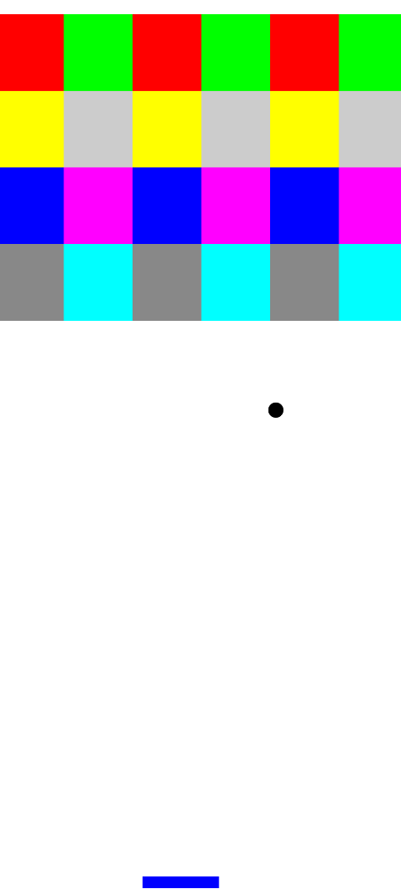
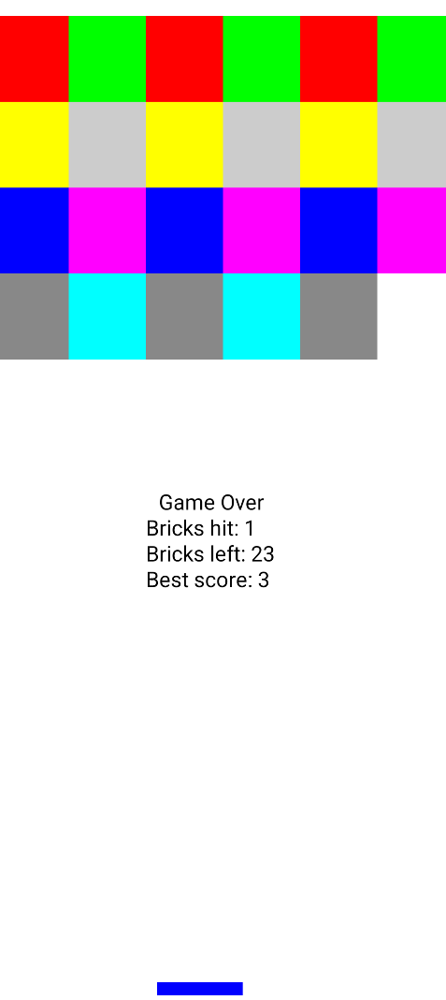

# 🧱 Brick Breaker (Android)

A modern clone of the classic **Brick Breaker** arcade game built with native Android tools and Kotlin.

---

## 🎮 Gameplay

Control the paddle to bounce the ball and break all the bricks! The game ends when the ball falls past your paddle.

---

## ✨ Features

- 🧠 **Physics-based Collision System** for paddle, wall, and brick interactions
- 🔊 **Sound Effects** for ball collisions
- 🧮 **Scoring System** that tracks your points
- ❌ **Game Over Detection** when the ball hits the bottom of the screen
- 📱 **Optimized for Android Devices** — smooth performance with a simple UI

---

## 🖼 Screenshots

| Gameplay | Gameover |
|------------|------------|
|  |  |

---

## 🔧 Build & Run

1. **Clone or download** this repository:
   ```bash
   git clone https://github.com/your-username/brick-breaker-android.git
